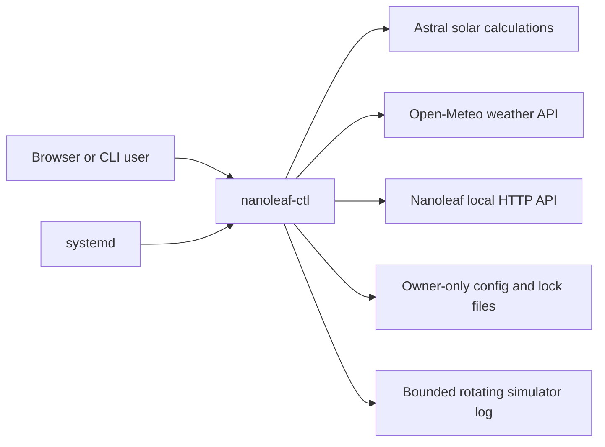
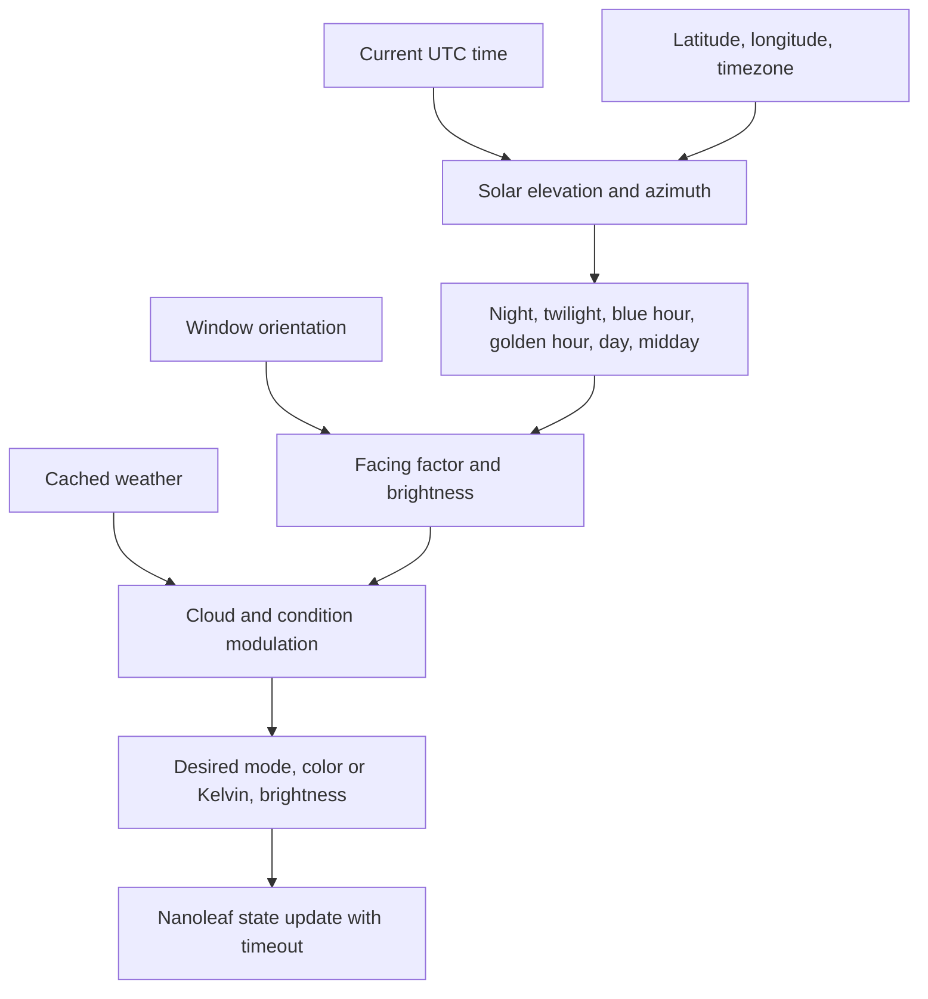
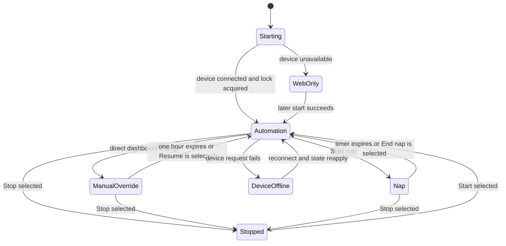

# Architecture

## Purpose

NanoLeaf Sunlight Simulator is a local home-automation service. It makes a
Nanoleaf installation behave like daylight entering through a configured
window while retaining direct manual controls.

The system favors predictable local operation:

- Device control stays on the LAN.
- Weather is the only normal external data dependency.
- Automation continues using solar calculations if weather is unavailable.
- Device and network failures do not terminate the web service.
- A person can override automation without permanently disabling it.

## System context

The Nanoleaf device API is reached over local HTTP on port 16021. Open-Meteo
is reached over HTTPS. The dashboard listens on port 5000 by default.

## Source layout

| Module | Responsibility |
|---|---|
| `nanoleaf_ctl/cli.py` | Argument parsing and command implementations |
| `nanoleaf_ctl/client.py` | Discovery, pairing, saved-token connection, and direct device operations |
| `nanoleaf_ctl/config.py` | Atomic credential persistence and exclusive simulator lock |
| `nanoleaf_ctl/sunlight.py` | Solar model, window orientation, weather modulation, and device application |
| `nanoleaf_ctl/weather.py` | Open-Meteo lookup and ten-minute weather cache |
| `nanoleaf_ctl/web.py` | Flask API, embedded dashboard, automation lifecycle, timed overrides, health, and logs |
| `nanoleaf.service` | Hardened systemd service for the Raspberry Pi deployment |

## Startup sequence

The systemd unit uses `Type=notify` and a 120-second watchdog.

1. `nanoleaf-ctl web` binds the HTTP socket.
2. The process starts the independent systemd watchdog thread.
3. The process sends `READY=1` to systemd.
4. Device connection and simulator auto-start run in a background worker.
5. The Flask server accepts dashboard and API requests.
6. If the device is temporarily unavailable, the web service remains healthy.

Device connection must not block systemd readiness. This separation is
important on small Raspberry Pi hardware and when a Nanoleaf is powered off.

## Automation pipeline

Every normal automation cycle performs the following work:

1. Calculate solar elevation and azimuth for the configured coordinates.
2. Select a phase and base light color from solar elevation.
3. Scale brightness using the angle between the sun and window orientation.
4. Retrieve cached weather and apply cloud/condition adjustments.
5. Compare the desired state with the last applied state.
6. If needed, send a bounded-time HTTP request to the Nanoleaf.
7. Sleep until the next 60-second cycle.

### Solar phases

| Solar elevation | Typical phase | Output |
|---|---|---|
| Below -18 degrees | Night | Off, or optional dim warm glow |
| -18 to -6 degrees | Twilight | Very dim deep blue |
| -6 to 0 degrees | Blue hour | Blue-purple RGB light |
| 0 to 6 degrees | Golden hour | Warm orange/salmon RGB light |
| 6 to 15 degrees | Low daylight | Warm white trending toward neutral |
| 15 to 40 degrees | Day | Neutral white trending toward 5500 K |
| Above 40 degrees | Midday | Cool neutral white at configured peak |

### Window orientation

The facing factor is based on the absolute angle between solar azimuth and the
window's configured compass direction:

- within 45 degrees: full direct-light factor;
- 45-90 degrees: linearly reduced direct light;
- 90-135 degrees: weak indirect light;
- beyond 135 degrees: ten-percent ambient factor.

### Weather

`WeatherCache` refreshes Open-Meteo data every ten minutes. Cloud cover reduces
brightness. Overcast and precipitation reduce it further, desaturate RGB
colors, and can shift white light cooler. If the fetch fails, cached weather is
used when available; otherwise the solar result remains usable.

## Runtime state model

The web process maintains these important states under `_sim_lock`:

- simulator running/stopped;
- normal/demo mode;
- current computed state and configuration;
- device online/offline and last-seen time;
- automation/manual-override/nap/stopped control mode;
- generation number for superseding old threads;
- process-level lock handle.

Direct dashboard changes to power, brightness, color, color temperature, or an
effect start a one-hour manual override. The automation thread keeps computing
state but does not overwrite the person's choice. Resume ends the override and
forces reconciliation on the next cycle.

Nap Mode is a second timed override with a narrower purpose. It atomically
applies a low-brightness warm-amber color scene, records the scheduled end, and
prevents normal simulator writes until that time. The automation loop checks
the timer once per second and invalidates its last-applied state when the nap
ends, forcing prompt reconciliation with the current daylight calculation.

## Concurrency and duplicate prevention

Several mechanisms address different duplicate-controller risks:

1. `_sim_lock` serializes state changes inside the web process.
2. A generation counter causes superseded simulator threads to exit.
3. `sunlight.lock` uses an OS-level exclusive file lock to prevent another
   local process from running the simulator.
4. The lock records `hostname:pid` for diagnostics.
5. Device-brightness readback detects likely control by another machine.
6. systemd is the sole documented production launch path on the Pi.

The file lock only protects one host. It cannot prevent a controller on a
different computer from controlling the same Nanoleaf.

## Reliability mechanisms

- All application-owned Nanoleaf requests have a ten-second timeout.
- Failed device calls mark the device offline instead of terminating the loop.
- Reconnection clears the previous state key and reapplies the current target.
- Configuration writes are atomic and owner-only.
- systemd restarts unexpected process exits after five seconds.
- A dedicated thread feeds the systemd watchdog independently of automation.
- Logging setup is serialized so two startup threads cannot add duplicate
  handlers.
- The simulator log rotates at 1 MB with three backups.
- Existing logs are scrubbed and bounded without loading the full file into
  memory, which is critical on a Raspberry Pi Zero 2 W.
- The in-memory diagnostic log retains only the latest 200 lines.

## Persistence

| Path | Contents | Expected permissions |
|---|---|---|
| `~/.config/nanoleaf-ctl/config.json` | Device IP and authentication token | `600` |
| `~/.config/nanoleaf-ctl/sunlight.lock` | Active simulator holder metadata | Owned by service user |
| `~/.nanoleaf-ctl/sunlight.log` | Current persistent simulator log | `600` |
| `~/.nanoleaf-ctl/sunlight.log.1` etc. | Rotated logs | Owner-only via service umask |

## Security boundary

The dashboard has no login or request authentication. Anyone who can reach port
5000 can control the lights and read device metadata exposed by the API. The
service is therefore appropriate for a trusted LAN, not direct internet
exposure. See [Security](docs/SECURITY.md) for the full model.

The systemd unit reduces host impact with `NoNewPrivileges`, `PrivateTmp`, a
read-only home view, a strict read-only system view, and explicit writable paths
for application state.

## Known constraints

- The embedded Flask/Werkzeug server is intended for a trusted home LAN, not a
  public production web workload.
- Default location and deployment paths are intentionally specific to the
  current owner; other installations must override them.
- Weather is current-condition modulation, not room-level closed-loop sensing.
- Conflict detection observes brightness only and cannot identify a remote
  controller by name.
- The device token is stored locally because the Nanoleaf API requires it.
