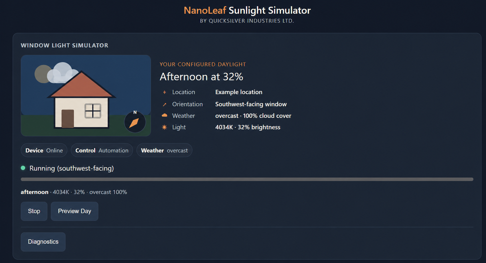
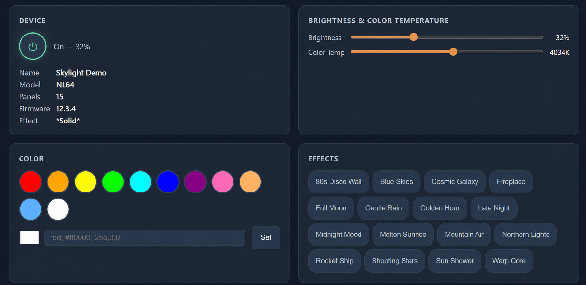

# Dashboard Screenshots

These screenshots show the two principal dashboard views. Location and device
identifiers have been replaced with example values for privacy. Brightness,
weather, device state, and other runtime values are illustrative and will vary.

## Sunlight automation

The sunlight view explains what the automation is doing and why. It combines
the configured window orientation with current weather, solar phase, color
temperature, and brightness. It also exposes simulator state, manual override
status, day preview, and diagnostics.

## Device controls

The device view provides direct power, brightness, color-temperature, color,
and saved-effect controls. Direct changes temporarily yield control from the
sunlight automation so that a person can make an intentional adjustment.

Before controlling a physical device, read the project's
[device safety and third-party notice](../SAFETY.md) and follow Nanoleaf's
[official instructions](https://support.nanoleaf.me/hc/en-us) for the exact
model.
